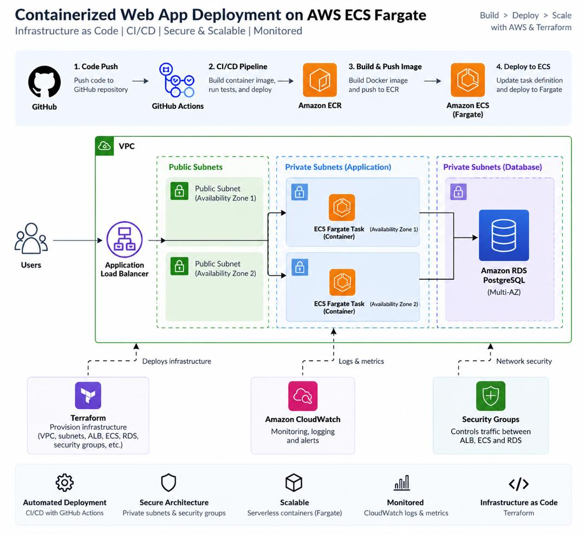

# AWS ECS Fargate REST API

A containerized REST API deployed using Docker and designed for AWS ECS Fargate.

## Architecture

User
  ↓
Application Load Balancer
  ↓
ECS Fargate
  ↓
RDS PostgreSQL

## Technologies

- AWS ECS Fargate
- Amazon ECR
- Application Load Balancer
- Amazon RDS PostgreSQL
- Docker
- Terraform
- GitHub Actions
- AWS CloudWatch
- Linux

## Project Features

- Containerized Node.js REST API
- PostgreSQL database integration
- Health-check endpoint
- Docker image stored in Amazon ECR
- ECS Fargate deployment configuration
- Infrastructure defined with Terraform
- GitHub Actions CI/CD workflow
- AWS credentials managed through GitHub Secrets

## Terraform

Terraform was used to define the AWS infrastructure, including:

- VPC
- Public and private subnets
- Internet Gateway
- NAT Gateway
- Security groups
- Application Load Balancer
- ECS cluster and service
- RDS PostgreSQL

The infrastructure configuration was validated with Terraform and successfully passed `terraform plan`.

## CI/CD

GitHub Actions automates the deployment workflow:

1. Checkout source code
2. Configure AWS credentials
3. Authenticate with Amazon ECR
4. Build the Docker image
5. Push the image to ECR
6. Update the ECS service

## Learning Outcome

This project provided hands-on experience combining containerization, AWS networking, ECS Fargate, infrastructure as code, database connectivity, and CI/CD automation into a single DevOps workflow.

## ARCHITECTURE

